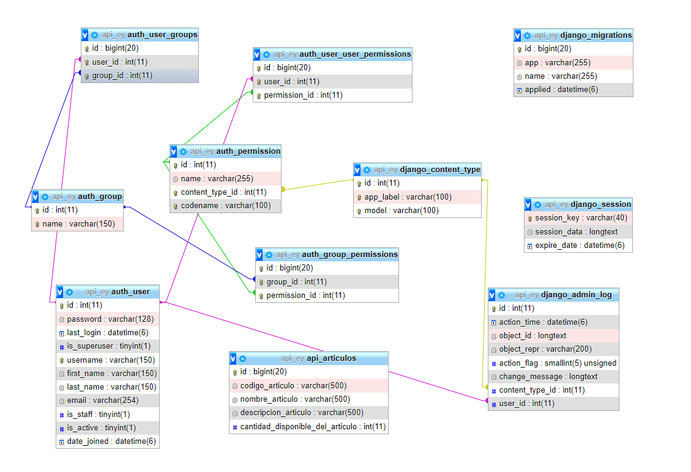

# Api_Django

## Requerimientos 
- Django== 4.1.5
- django-cors-headers==3.13.0
- mysqlclient==2.1.1
- pycodestyle==2.8.0
- PyMySQL==1.0.2
- pytz==2021.1
- Xamp=== 3.2.1

### Intrucciónes de ejecución

- Clona el proyecto utilizando git o descargalo en archivo zip
- Ubicate en la carpeta principal accede a la siguiente carpeta api_ey
```
cd api_ey
```
- Crea una base de datos llamada api_ey en MySQL
- Ir a la terminal y poner poder realizar las migraciones en Django, asegurate que en XAMP tengas activado MySQL:
```
python manage.py migrate
```
- Luego
```
python manage.py makemigrations
```
- Ingresamos a MySQL a la tabla api_articulos de la base de datos api_ey e insertamos los siguientes datos: 
```
INSERT INTO `api_articulos` (`id`, `codigo_articulo`, `nombre_articulo`, `descripcion_articulo`, `cantidad_disponible_del_articulo`) VALUES (NULL, 'Art001', 'Detergente', 'Descripción', '3'), (NULL, 'Art002', 'Comida Enlatada', 'Descripción', '')
```
- Ahora ejecutemos la aplicación con el siguiente comando:
```
python manage.py runserver
```
- Accedemos en cualquier navegador al siguiente enlace:
```
http://127.0.0.1:8000/api/articulos/
```
- Aqui podremos observar a nuestra api y realizar en Postman o Thunder Client las peticiones (GET, PUT, POST, DELETE)

## Modelo Entidad Relación
